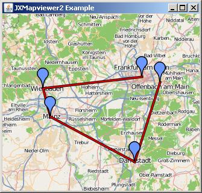
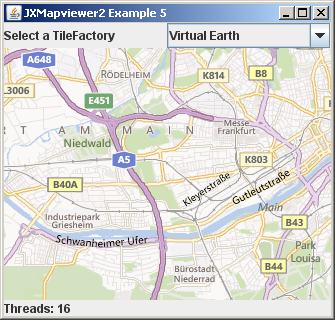

#### Overview

This project is based on the JXMapViewer component of SwingX-WS.

The project was hosted at SwingLabs.org, but has been discontinued. We extracted the JXMapViewer part from the latest SwingX-WS version available and continue developing it.

The [JXMapViewer Tutorial by Joshua Marinacci](http://today.java.net/pub/a/today/2007/10/30/building-maps-into-swing-app-with-jxmapviewer.html) gives a good overview over the functionality of the component.

This source code used in this project is based on: 

 * SwingX-ws-2009_06_14.jar http://java.net/projects/swingx 
 * SwingX 1.6.3 (released Feb 2012) http://java.net/projects/swingx-ws

The content of this project are also available at *Maven Central* and can be referenced in your pom.xml:

    <dependency>
      <groupId>org.jdesktop.swingx</groupId>
      <artifactId>jxmapviewer2</artifactId>
      <version>1.1</version>
    </dependency>

#### What we have done so far ..

 * Extract the JXMapViewer part from the full package
 * Upgrade to Java 6
 * Fixed javadoc
 * Replaced `system.out.println()` with `apache.commons.logging` 
 * Removed broken TileProviders
 * Remove dependencies to SwingX (and its indirect dependencies)
 * Fixed tile caching so that only tiles are cached, not everything
 * Extract user interaction from the viewer
 * Make CompoundPainter use Lists instead of Arrays
 * Find out what the "Java One" hack is and replace it with proper implementation
 * Improved zooming in - images of coarser resolution are used until new images are loaded
 * Fixed thread leak when setting new TileFactory
 * Supports OSGi bundles (contains MANIFEST.MF)
 * Supports Maven dependency management
 
#### What we plan to do ..

 * Fix bugs that were posted on http://java.net/jira/browse/SWINGX_WS ( mostly complete )

#### License
This project has been licensed under the GNU Lesser General Public License (LGPL)

